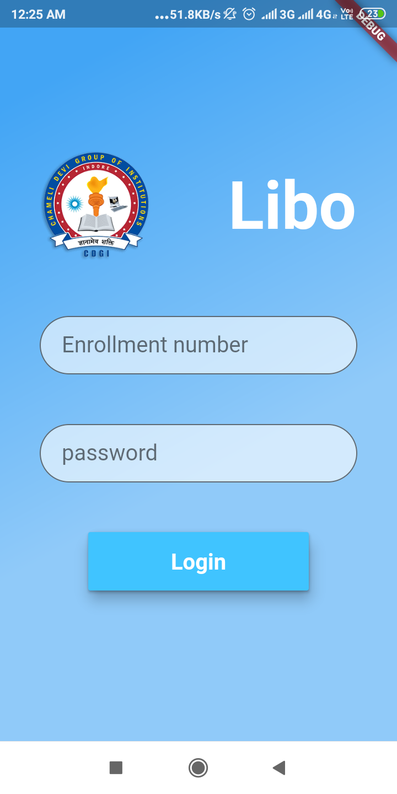
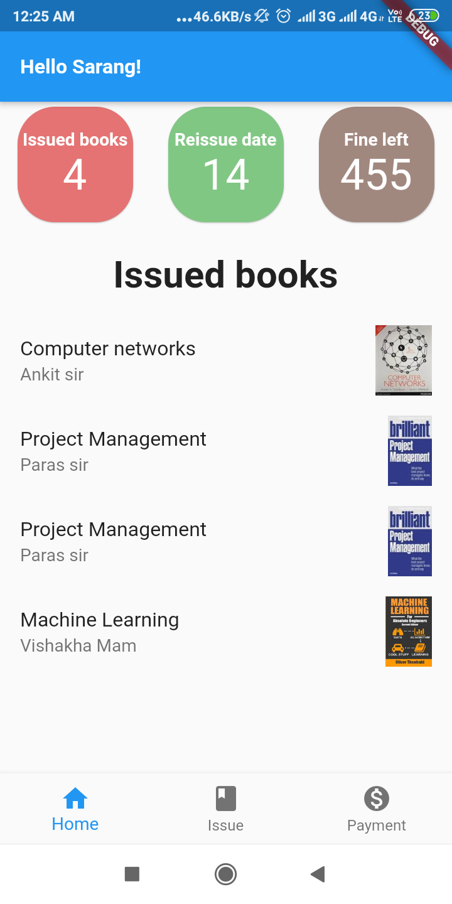
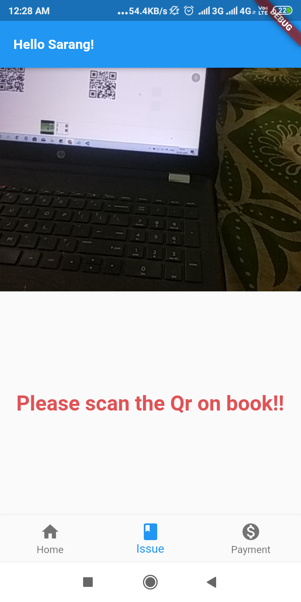
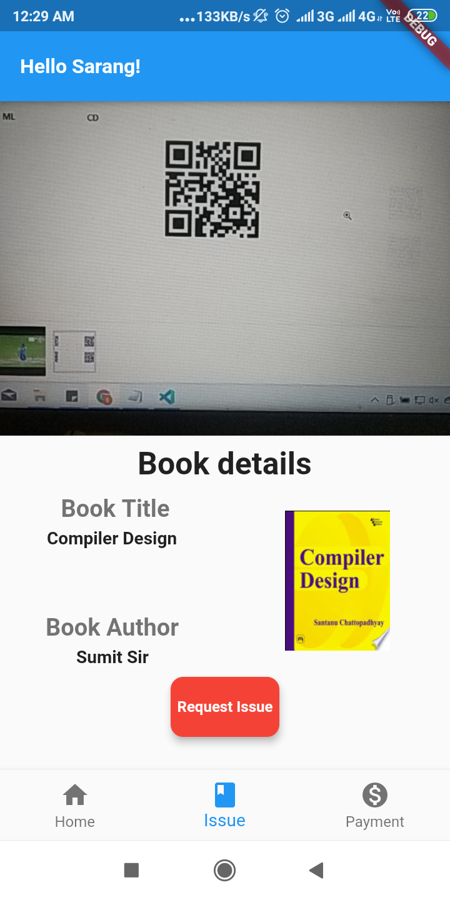

# libo
A library management mobile application with feature of scanning and issuing the books just by tap of a few buttons.
 <h3>Frontend</h3>
 &nbsp&nbspFlutter Framework with dart.
 <h3>Backend</h3>
    &nbsp&nbspCloud firestore/ Firebase.
    
   # UI Design   
  
  <h3>Login Page</h3>
   
   
  <h3>Home Page</h3> 
 

 <h3>Pre-scan Page</h3> 
 

<h3>Post-scan Page</h3> 
 

<h3>Post-scan Page</h3> 
 
